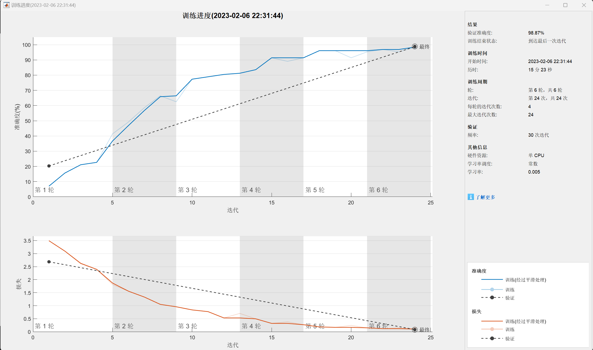
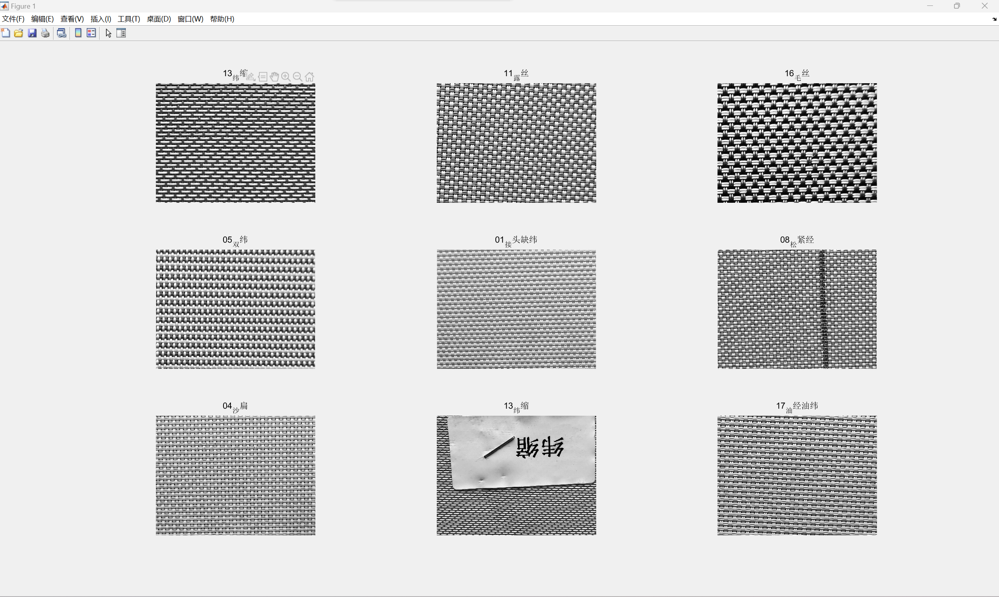

# Fabric-Defection-Detection
山东大学（威海）2022年机器学习项目———布匹缺陷检测
# 结果预览
# 
# 
### 测试环境： 
### CPU : 12th Gen Intel(R) Core(TM) i7-12700H   2.70 GHz
### GPU : NVIDIA RTX3070Ti
### RAM : 32GB
### Matlab R2020a (Deep Learning Tools)
### 注 ：Data文件过大 未上传
# 1.神经网络概述
人工神经网络（Artificial Neural Networks，ANN）是一种模拟生物神经系统的结构和行为，进行分布式并行信息处理的算法数学模型。ANN通过调整内部神经元与神经元之间的权重关系，从而达到处理信息的目的。而卷积神经网络（Convolutional Neural Network，CNN）是一种前馈神经网络，它由若干卷积层和池化层组成，尤其在图像处理方面CNN的表现十分出色。

CNN的基本结构由输入层、卷积层（convolutional layer）、池化层（pooling layer，也称为取样层）、全连接层及输出层构成。卷积层和池化层一般会取若干个，采用卷积层和池化层交替设置，即一个卷积层连接一个池化层，池化层后再连接一个卷积层，依此类推。由于卷积层中输出特征图的每个神经元与其输入进行局部连接，并通过对应的连接权值与局部输入进行加权求和再加上偏置值，得到该神经元输入值，该过程等同于卷积过程，CNN也由此而得名
# 2.图像数据预处理
# 3.缺陷检测
# 4.训练与测试
# 5.总结
