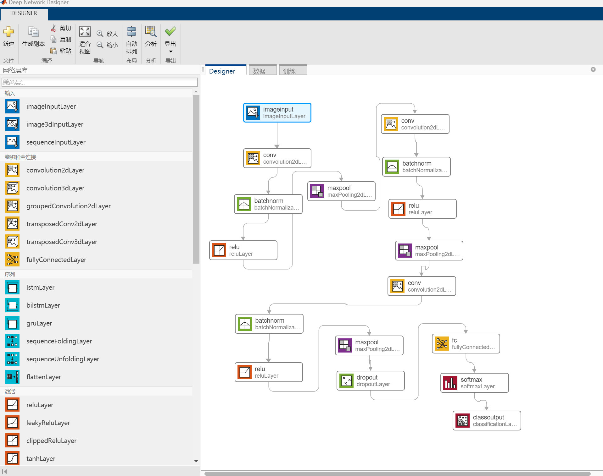
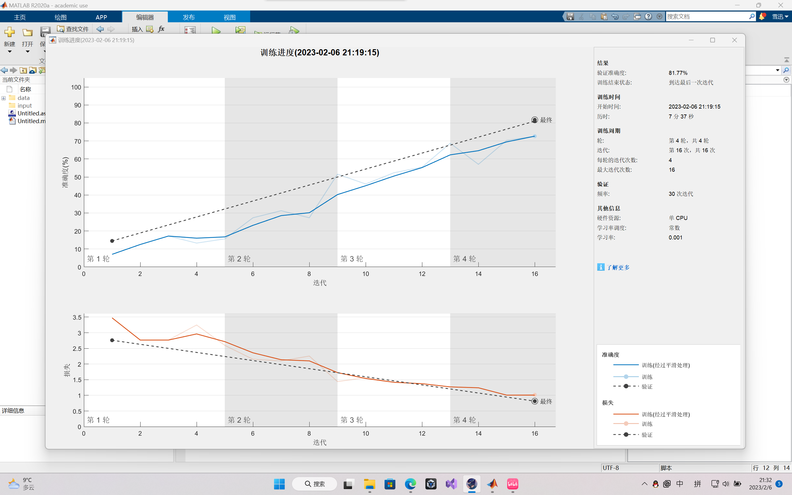
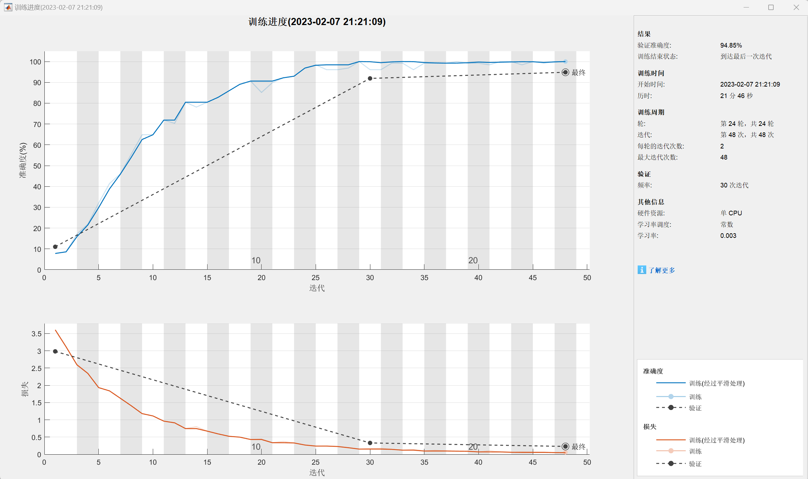
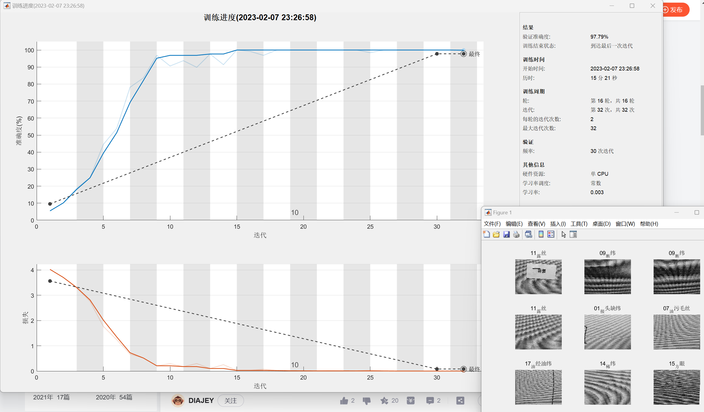
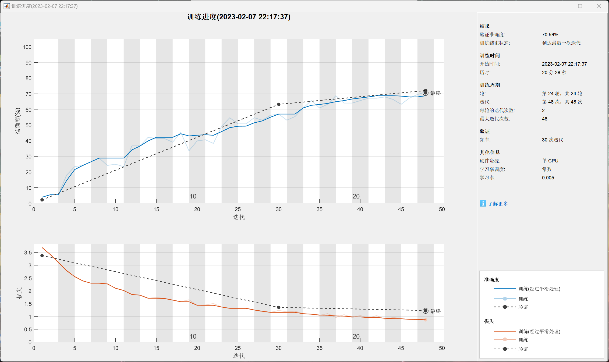
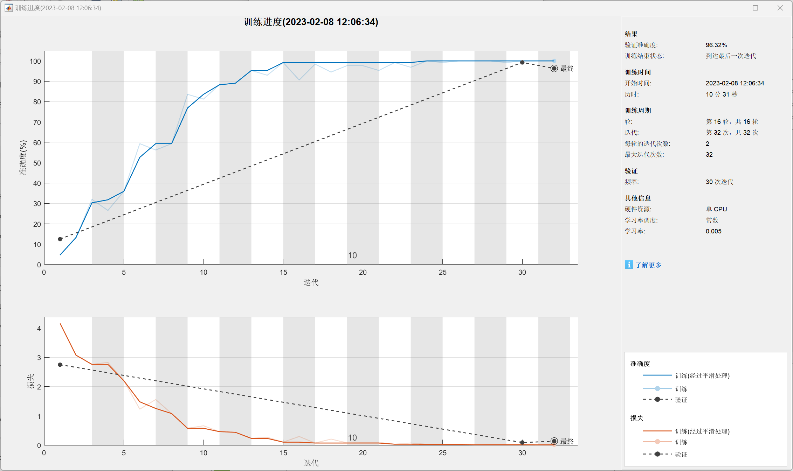

# Fabric-Defection-Detection
山东大学（威海）2022年机器学习项目———布匹缺陷检测
# 结果预览
# 
# 
### 测试环境： 
### CPU : 12th Gen Intel(R) Core(TM) i7-12700H   2.70 GHz
### GPU : NVIDIA RTX3070Ti
### RAM : 32GB
### Matlab R2020a (Deep Learning Tools)
### 注 ：Data文件过大 未上传
# 一.神经网络概述
## 1. 卷积神经网络概念
人工神经网络（Artificial Neural Networks，ANN）是一种模拟生物神经系统的结构和行为，进行分布式并行信息处理的算法数学模型。ANN通过调整内部神经元与神经元之间的权重关系，从而达到处理信息的目的。而卷积神经网络（Convolutional Neural Network，CNN）是一种前馈神经网络，它由若干卷积层和池化层组成，尤其在图像处理方面CNN的表现十分出色。

CNN的基本结构由输入层、卷积层（convolutional layer）、池化层（pooling layer，也称为取样层）、全连接层及输出层构成。卷积层和池化层一般会取若干个，采用卷积层和池化层交替设置，即一个卷积层连接一个池化层，池化层后再连接一个卷积层，依此类推。由于卷积层中输出特征图的每个神经元与其输入进行局部连接，并通过对应的连接权值与局部输入进行加权求和再加上偏置值，得到该神经元输入值，该过程等同于卷积过程，CNN也由此而得名

图像输入层：用于指定图像大小。这些数字对应于高度、宽度和通道大小。数字数据由灰度图像组成，因此通道大小（颜色通道）为 1。对于彩色图像，通道大小为 3，对应于 RGB 值。

卷积层：在三层卷积层中，第一层有8个3x3的卷积核，第二层有16个3x3的卷积核，第三层有32个3x3的卷积核。卷积层逐渐加深，不断提取输入图像的特征。
批量归一化层批量归一化层对网络中的激活值和梯度传播进行归一化，使网络训练成为更简单的优化问题。在卷积层和非线性部分（例如 ReLU 层）之间使用批量归一化层，来加速网络训练并降低对网络初始化的敏感度。

ReLU 层：批量归一化层后接一个非线性激活函数。最常见的激活函数是修正线性单元 (ReLU)。使用 reluLayer 创建 ReLU 层。

最大池化层：卷积层（带激活函数）有时会后跟下采样操作，以减小特征图的空间大小并删除冗余空间信息。通过下采样可以增加更深卷积层中的滤波器数量，而不会增加每层所需的计算量。下采样的一种方法是使用最大池化，在此示例中，该矩形区域的大小是2

全连接层：卷积层和下采样层后跟一个或多个全连接层。顾名思义，全连接层中的神经元将连接到前一层中的所有神经元。该层将先前层在图像中学习的所有特征组合在一起，以识别较大的模式。最后一个全连接层将特征组合在一起来对图像进行分类。因此，最后一个全连接层中的 OutputSize 参数等于目标数据中的类数。

softmax 层： softmax 激活函数对全连接层的输出进行归一化。

分类层：最终层是分类层。该层使用 softmax 激活函数针对每个输入返回的概率，将输入分配到其中一个互斥类并计算损失。
## 2. 卷积神经网络的特点
卷积神经网络由多层感知机（MLP）演变而来，由于其具有局部区域连接、权值共享、降采样的结构特点，使得卷积神经网络在图像处理领域表现出色。卷积神经网络相比于其他神经网络的特殊性主要在于权值共享与局部连接两个方面。权值共享使得卷积神经网络的网络结构更加类似于生物神经网络。局部连接不像传统神经网络那样，第n-1层的每一神经元都与第n层的所有神经元连接，而是第n-1层的神经元与第n层的部分神经元之间连接。这两个特点的作用在于降低了网络模型的复杂度，减少了权值的数目。
# 二.图像数据预处理
## 2.1处理步骤
1.加载数据集

2.显示类别数量

3.图像的维度大小

4.为了使各类样本数量平衡选取数量最少的基准抽取样本

5.图像预处理，将图像转换

6.样本分割,随机抽取样本分割7:3的训练集和验证集

### 2.1.1加载数据集
imageDatastore()函数用于读取指定路径下的所有文件
使用语法：
ImageDatastore(path,Name,Value)
输入参数为文件（夹）路径，以及一些键值对，输出为一个ImageDatastore对象。

imageDatastore
作用：构建数据集
语法：imds = imageDatastore('./images', 'IncludeSubfolders', true, 'labelsource', 'foldernames')

./images： 表示文件所在的路径；

Includesubfolders： 是否继续读取子文件夹中的图像数据，为 true 表示继续读取；

labelsource： 图像 label 的来源是什么；

foldernames： 文件夹名；
### 2.1.2显示类别数量
tbl = countEachLabel(imds) ⇒ 见名知意，创建一个表格，某一label图像，及其对应的图像个数；

### 2.1.3图像的维度大小

imread函数
用法： A = imread(filename.fmt) 

根据文件名filename读取灰度获彩色图像。返回的数组A包含图像数据。
若文件包含灰色图像，A是MxN的数组；若文件名包含真彩图像，A是MxNx3的数组。

imds.Files：全部文件名构成的 cell 集合；

### 2.1.4为了使各类样本数量平衡选取数量最少的基准抽取样本
minSetCount = min(tbl{:,2});
返回数组的最小元素。

如果 A 是向量，则 min(A) 返回 A 的最小值。

如果 A 为矩阵，则 min(A) 是包含每一列的最小值的行向量。

如果 A 是多维数组，则 min(A) 沿大小不等于 1 的第一个数组维度计算，并将这些元素视为向量。此维度的大小将变为 1，而所有其他维度的大小保持不变。如果 A 是第一个维度为 0 的空数组，则 min(A) 返回与 A 大小相同的空数组。

imds = splitEachLabel(imds, minSetCount, 'randomize');

### 2.1.5图像预处理，将图像转换
ReadFcn - 用于读取图像数据的函数
@readDatastoreImage（默认） | 函数句柄
读取图像数据的函数，指定为函数句柄。函数必须将图像文件名称作为输入，然后输出对应的图像数据。例如，如果 customreader 是指定用来读取图像数据的函数，则它必须具有类似于以下内容的签名：

function data = customreader(filename)
...
end
如果有多个输出参数，则只使用第一个，而忽略其余参数。

### 2.1.6样本分割,随机抽取样本分割为7:3的训练集和验证集

splitEachLabel：拆分数据集
[imds1,imds2] = splitEachLabel(imds, p);

p 可以是一个小数，表示百分比，根据百分比划分；
也可以是一个整数，根据这一整数进行划分；

# 三.缺陷检测
## 3.1可视化工具Deep Learning Tools（matlab工具）
### 3.1.1 MATLAB与深度学习的简介

使用应用程序和可视化工具创建、修改和分析深度学习架构。

使用应用程序预处理数据，并自动对图像、视频和音频数据进行真值标注。

在 NVIDIA® GPU、云和数据中心资源上加速算法，而无需专门编程。与基于 TensorFlow、PyTorch 和 MxNet 等框架的使用者开展协作。

使用强化学习仿真和训练动态系统行为。

从物理系统的 MATLAB 和 Simulink® 模型生成基于仿真的训练和测试数据。

### 3.1.2 深度学习层: 使用以下函数创建不同层类型。或者，使用深度网络设计器以交互方式创建网络。

#### 输入层

imageInputLayer:图像输入层向网络输入二维图像，并应用数据归一化。

image3dInputLayer:三维图像输入层向网络输入三维图像或三维体，并应用数据归一化。

sequenceInputLayer:序列输入层向网络输入序列数。

featureInputLayer:特征输入层将特征数据输入网络并应用数据归一化。当您有表示特征的数值标量数据集（数据没有空间和时间维度）时，请使用此层。

roiInputLayer (Computer Vision Toolbox):ROI 输入层将图像输入到 Fast R-CNN 目标检测网络。

#### 卷积和全连接层
convolution2dLayer：二维卷积层对输入应用滑动卷积滤波器。

convolution3dLayer：三维卷积层将滑动立方体卷积滤波器应用于三维输入。

groupedConvolution2dLayer：二维分组卷积层将输入通道分成各个组，并应用滑动卷积滤波器。使用分组卷积层进行按通道可分离（也称为按深度可分离）卷积。

transposedConv2dLayer：转置的二维卷积层对特征图进行上采样。

transposedConv3dLayer：转置的三维卷积层对三维特征图进行上采样。

fullyConnectedLayer：全连接层将输入乘以权重矩阵，然后添加偏置向量。

#### 序列层
sequenceInputLayer：序列输入层向网络输入序列数据。

lstmLayer：LSTM学习时序和序列数据中时间步之间的长期相关性。

bilstmLayer：双向 LSTM (BiLSTM) 层学习时序或序列数据的时间步之间的双向长期相关性。当您希望网络在每个时间步从完整时序中学习时，这些相关性会很有用。

gruLayer：GRU 层学习时序和序列数据中时间步之间的相关性。

sequenceFoldingLayer：序列折叠层将一批图像序列转换为一批图像。使用序列折叠层独立地对图像序列的时间步执行卷积运算。

sequenceUnfoldingLayer：序列展开层在序列折叠后还原输入数据的序列结构。

flattenLayer：扁平化层将输入的空间维度折叠成通道维度。

wordEmbeddingLayer：(Text Analytics Toolbox)单词嵌入层将单词索引映射到向量。

#### 激活层
reluLayer：ReLU 层对输入的每个元素执行阈值运算，其中任何小于零的值都设置为零。

leakyReluLayer：泄漏 ReLU 层执行阈值运算，其中小于零的任何输入值都乘以固定标量。

clippedReluLayer：裁剪 ReLU 层执行阈值运算，其中任何小于零的输入值都设置为零，裁剪上限以上的任何值都设置为该裁剪上限。

eluLayer：ELU 激活层对正输入执行单位运算，对负输入执行指数非线性运算。

tanhLayer：双曲正切 (tanh) 激活层对层输入应用 tanh 函数。

preluLayer（自定义层示例）：PReLU 层执行阈值运算，其中对于每个通道，任何小于零的输入值都乘以在训练时学习到的标量。
#### 归一化、丢弃和裁剪层
batchNormalizationLayer：批量归一化层对小批量中的每个输入通道进行归一化。为了加快卷积神经网络的训练并降低对网络初始化的敏感度，请在卷积层和非线性部分之间使用批量归一化层，如 ReLU 层。

groupNormalizationLayer：组归一化层将输入数据的通道划分为若干组，并对每组中的激活进行归一化。为了加快卷积神经网络的训练并降低对网络初始化的敏感度，请在卷积层和非线性部分之间使用组归一化层，如 ReLU 层。通过设置适当的组数，可以执行实例归一化和层归一化。

crossChannelNormalizationLayer：按通道局部响应（跨通道）归一化层执行按通道归一化。

dropoutLayer：丢弃层以给定的概率将输入元素随机设置为零。

crop2dLayer：二维裁剪层对输入应用二维裁剪。

crop3dLayer：三维裁剪层将三维体裁剪到输入特征图的大小。

resize2dLayer (Image Processing Toolbox)：二维调整大小层根据缩放因子或指定的高度和宽度调整二维输入的大小。

resize3dLayer (Image Processing Toolbox)：三维调整大小层根据缩放因子或指定的高度、宽度和深度调整三维输入的大小。

#### 池化和去池化层
averagePooling2dLayer：平均池化层通过将输入划分为矩形池化区域并计算每个区域的平均值来执行下采样。

averagePooling3dLayer：三维平均池化层通过将三维输入划分为立方体池化区域并计算每个区域的平均值来执行下采样。

globalAveragePooling2dLayer：全局平均池化层通过计算输入的高度和宽度维度的均值来执行下采样。

globalAveragePooling3dLayer：三维全局平均池化层通过计算输入的高度、宽度和深度维度的均值来执行下采样。

maxPooling2dLayer：最大池化层通过将输入划分为矩形池化区域并计算每个区域的最大值来执行下采样。

maxPooling3dLayer：三维最大池化层通过将三维输入划分为立方体池化区域并计算每个区域的最大值来执行下采样。

globalMaxPooling2dLayer：全局最大池化层通过计算输入的高度和宽度维度的最大值来执行下采样。

globalMaxPooling3dLayer：三维全局最大池化层通过计算输入的高度、宽度和深度维度的最大值来执行下采样。

maxUnpooling2dLayer：最大去池化层对最大池化层的输出进行去池化。
#### 组合层
additionLayer：相加层按元素将来自多个神经网络层的输入相加。

multiplicationLayer：相乘层按元素将来自多个神经网络层的输入相乘。

depthConcatenationLayer：深度串联层接受具有相同高度和宽度的输入，并沿第三个维度（通道维度）串联它们。

concatenationLayer：串联层接受输入并沿指定维度串联它们。除串联维度外，所有其他维度中的输入必须具有相同的大小。

weightedAdditionLayer（自定义层示例）：加权相加层按元素对来自多个神经网络层的输入进行缩放和相加。

输出层
softmaxLayer：softmax 层对输入应用 softmax 函数。

sigmoidLayer：sigmoid 层对输入应用 sigmoid 函数，使得输出在区间 (0,1) 内有界。

classificationLayer：分类层计算具有互斥类的多类分类问题的交叉熵损失。

regressionLayer：回归层计算回归问题的半均方误差损失。

pixelClassificationLayer (Computer Vision Toolbox)：像素分类层为每个图像像素或体素提供分类标签。

dicePixelClassificationLayer (Computer Vision Toolbox)：Dice 像素分类层使用广义 Dice 损失为每个图像像素或体素提供分类标签。

focalLossLayer (Computer Vision Toolbox)：焦点损失层使用焦点损失预测目标类。

rpnSoftmaxLayer (Computer Vision Toolbox)：区域提议网络 (RPN) softmax 层对输入应用 softmax 激活函数。使用此层创建一个 Faster R-CNN 目标检测网络。

rpnClassificationLayer (Computer Vision Toolbox)：区域提议网络 (RPN) 分类层通过使用交叉熵损失函数将图像区域分类为目标或背景。使用此层创建一个 Faster R-CNN 目标检测网络。

rcnnBoxRegressionLayer (Computer Vision Toolbox)：框回归层通过使用平滑 L1 损失函数来细化边界框位置。使用此层创建一个 Fast 或 Faster R-CNN 目标检测网络。

weightedClassificationLayer：加权分类层计算分类问题的加权交叉熵损失。

tverskyPixelClassificationLayer：Tversky 像素分类层使用 Tversky 损失为每个图像像素或体素提供分类标签。

sseClassificationLayer：分类 SSE 层计算分类问题的误差损失平方和。

maeRegressionLayer：回归 MAE 层计算回归问题的均值绝对误差损失。

## 3.2设计的神经网络结构如下图所示
### 
### 本次搭建的CNN网络结构如图所示
### 
### 图像输入层：用于指定图像大小，在本此项目中为 128×128×3。这些数字对应于高度、宽度和通道大小。通道大小（颜色通道）为 3。对于灰度图像，通道大小为 3，对应于 RGB 值。
### 卷积层：在三层卷积层中，第一层有8个3x3的卷积核，第二层有16个3x3的卷积核，第三层有32个3x3的卷积核。卷积层逐渐加深，不断提取输入图像的特征。
### 批量归一化层：批量归一化层对网络中的激活值和梯度传播进行归一化，使网络训练成为更简单的优化问题。在卷积层和非线性部分（例如 ReLU 层）之间使用批量归一化层，来加速网络训练并降低对网络初始化的敏感度。
### ReLU 层：批量归一化层后接一个非线性激活函数。最常见的激活函数是修正线性单元 (ReLU)。使用 reluLayer 创建 ReLU 层。
### 最大池化层：卷积层（带激活函数）有时会后跟下采样操作，以减小特征图的空间大小并删除冗余空间信息。通过下采样可以增加更深卷积层中的滤波器数量，而不会增加每层所需的计算量。下采样的一种方法是使用最大池化，在本次项目里，最大池化区域为[2，2]的矩形,步幅为3。
### 全连接层：卷积层和下采样层后跟一个或多个全连接层。顾名思义，全连接层中的神经元将连接到前一层中的所有神经元。该层将先前层在图像中学习的所有特征组合在一起，以识别较大的模式。最后一个全连接层将特征组合在一起来对图像进行分类。因此，最后一个全连接层中的 OutputSize 参数等于目标数据中的类数。本次分类的总数为17种。
### softmax层： softmax 激活函数对全连接层的输出进行归一化。
### 分类层：最终层是分类层。该层使用 softmax 激活函数针对每个输入返回的概率，将输入分配到其中一个互斥类并计算损失。
### 丢弃层：在代码中，我们以0.2的概率丢弃，防止出现过拟合的问题。
## 3.3 训练CNN网络
### 3.3.1 SGDM (SGD with Momentum,带动量的随机梯度下降)
mini-batch SGD算法虽然这种算法能够带来很好的训练速度，但是在到达最优点的时候并不能够总是真正到达最优点，而是在最优点附近徘徊。
另一个缺点就是mini-batch SGD需要我们挑选一个合适的学习率，当我们采用小的学习率的时候，会导致网络在训练的时候收敛太慢；当我们采用大的学习率的时候，会导致在训练过程中优化的幅度跳过函数的范围，也就是可能跳过最优点。我们所希望的仅仅是网络在优化的时候网络的损失函数有一个很好的收敛速度同时又不至于摆动幅度太大。
所以Momentum优化器刚好可以解决我们所面临的问题，它主要是基于梯度的移动指数加权平均，对网络的梯度进行平滑处理的，让梯度的摆动幅度变得更小。
### 
### 
### 
### 在本次项目中，我们运用了深度学习工具的绘图来实现可视化，如下图
### 
### 定义网络结构体后，指定训练选项。使用具有动量的随机梯度下降 (SGDM) 训练网络，初始学习率为 0.001。将最大训练轮数设置为 16。将数据分为训练集和测试集，对构建好的CNN进行训练.
## 3.4 卷积神经网络的实际分类测试
### 我们随机从验证集中抽取9张图片 将所预测的标签与验证集的标签想对比，得到如下结果，验证准确率是98.87%
### 
# 四.训练与测试
## 4.1特征维度
对于特征维度的选取：保持特征维度为唯一变量，保持学习率和正则化参数以及最大迭代次数相同时，通过观察验证准确度的变化来判断选取哪一特征维度更好

### 情况1：学习率：0.001，最大迭代次数为48

特征维度：64x64x3
#### 

特征维度：128x128x3
#### 

特征维度：256x256x3
#### 

#### 结果：
在特征维度：64x64x3时，验证准确度为48.53%，最大迭代次数为48，训练时间为22分20秒

在特征维度：128x128x3时，验证准确度为81.77%，最大迭代次数为16，训练时间为7分37秒

在特征维度：256x256x3时，验证准确度为94.85%，最大迭代次数为48，训练时间为15分51秒

### 情况2：学习率：0.003，最大迭代次数为48

特征维度：64x64x3
#### 

特征维度：128x128x3
#### 

特征维度：256x256x3
#### 

#### 结果：
在特征维度：64x64x3时，验证准确度为53.68%，最大迭代次数为48，训练时间为13分18秒

在特征维度：128x128x3时，验证准确度为94.85%，最大迭代次数为48，训练时间为21分46秒

在特征维度：256x256x3时，验证准确度为97.79%，最大迭代次数为32，训练时间为15分21秒

### 情况3：学习率：0.005，最大迭代次数为48

特征维度：64x64x3
#### 

特征维度：128x128x3
#### 

特征维度：256x256x3
#### 

#### 结果：
在特征维度：64x64x3时，验证准确度为70.59%，最大迭代次数为48，训练时间为20分28秒

在特征维度：128x128x3时，验证准确度为98.87%，最大迭代次数为24，训练时间为15分23秒

在特征维度：256x256x3时，验证准确度为96.32%，最大迭代次数为32，训练时间为10分31秒

### 结论：选取特征维度：128x128x3为最优

### 原因：
在特征维度：64x64x3时，无论选取哪一学习率，得出的验证准确度都偏低，无法得出正确的结论

在特征维度：256x256x3时，有训练时间过长的缺点

所以选取特征维度：128x128x3为最优

## 4.2学习率

在不同的特征维度下，不同的学习率可以在不同程度上改变验证准确度，且在不同的特征维度下，使达到最大验证准确度的学习率也不完全相同

## 4.3正则化参数的选取

Dropout正则化：

Dropout提供了正则化一大类模型的方法，计算方便但功能强大。简单来说Dropout可以理解为在概率意义上随机删除神经网络中的节点，以此简化神经网络模型来防止过拟合的一种正则化方法，下图说明了Dropout的处理过程。

Dropout会在每次迭代中随机关闭一些神经元,其中涉及到正则化参数keep_prob,keep_prob是一个随机数，在正向传播时，我们给每一个神经元赋予一个概率，通过比较keep_prob与神经元的随机概率大小来给出决策。当该概率小于keep_prob时，我们关闭该神经元。做法是通过应用掩码来关闭正向传播过程中的某些神经元。
对于反向传播，将用相同的掩码重新来关闭相同的神经元，进而进行导数的计算。
### 情况1 以0.2的概率设置丢弃层时

### 情况2 以0.3的概率设置丢弃层时 

### 情况3 以0.1的概率设置丢弃层时

### 情况4 以0.8的概率设置丢弃层时

## 4.4性能对比

学习率：在特征维度为64x64和128x128时，学习率为0.005时能得到最大验证准确度，但在特征维度为256x256时，达到最大验证准确度的学习率变为0.003

最大迭代次数：最大迭代次数越大，训练时间越长

正则化参数：选取1e-5时达到最好的效果
# 五.总结
## 5.1过拟合和欠拟合问题

### 一、定义
#### （一）过拟合：一个假设在训练数据上能够获得比其他假设更好的拟合， 但是在训练数据外的数据集上却不能很好地拟合数据，此时认为这个假设出现了过拟合的现象。(模型过于复杂)
#### （二）欠拟合：一个假设在训练数据上不能获得更好的拟合， 但是在训练数据外的数据集上也不能很好地拟合数据，此时认为这个假设出现了欠拟合的现象。(模型过于简单)
### 二、欠拟合原因以及解决办法
#### （一）原因：学习到数据的特征过少
#### （二）解决办法：增加数据的特征数量
### 三、过拟合原因以及解决办法
#### （一）原因：原始特征过多，存在一些嘈杂特征， 模型过于复杂是因为模型尝试去兼顾各个测试数据点。
#### （二）解决办法：
##### 1、进行特征选择，消除关联性大的特征(很难做)
##### 2、交叉验证(让所有数据都有过训练)
##### 3、正则化（尽量减小高次项特征的影响）(了解)
### 四、L2正则化
#### （一）作用：可以使得W的每个元素都很小，都接近于0。
#### （二）优点：越小的参数说明模型越简单，越简单的模型则越不容易产生过拟合现象。
## 5.2数据特征维度的选取

如果欠拟合可以尝试提高维度，如果过拟合可以尝试降低维度

## 5.3参数的选取
可以以数量级为单位选择，找到最合适的数量级再在该数量级内上下变动找到最合适参数。
